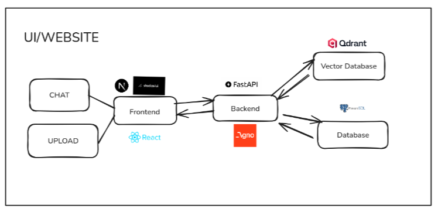
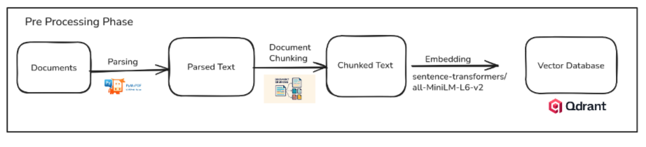
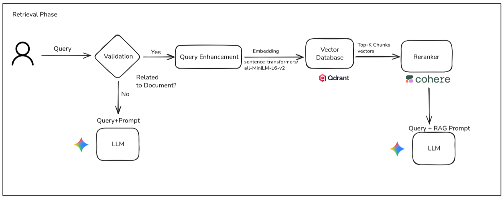
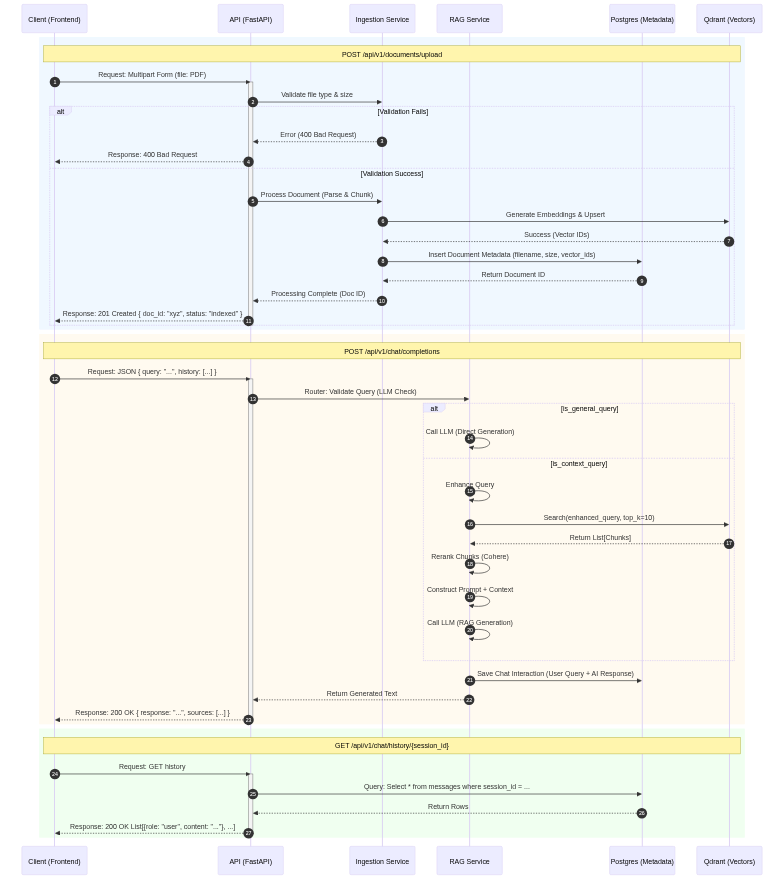

# Agni RAG 

This project is a robust Retrieval-Augmented Generation (RAG) application designed to allow users to upload documents and interact with them through a natural language chat interface.

Unlike simple RAG implementations, this system employs a sophisticated multi-stage retrieval pipeline that includes query validation, query enhancement, vector search, and result reranking to ensure highly accurate and context-aware responses. The architecture is built on a modern full-stack foundation using Next.js for the frontend and FastAPI for the backend.

## Features

* **Document Ingestion Pipeline:** Automated parsing, chunking, and vectorization of uploaded PDF documents.
* **Intelligent Query Routing:** A validation step determines if a user's query requires document context or if it can be answered generally by the LLM.
* **Query Enhancement:** User queries are rewritten or expanded to improve retrieval accuracy.
* **Two-Stage Retrieval:**
* **Stage 1:** Fast semantic search using dense vector embeddings (Qdrant).
* **Stage 2:** High-precision reranking of top results using Cohere.

* **Modern User Interface:** A clean chat and upload interface built with React, Next.js, and Shadcn UI.
* **Scalable Backend:** Built with FastAPI, utilizing both vector and relational databases.

---

## Architecture Overview

The application architecture is divided into three key components: the overall system infrastructure, the data pre-processing pipeline, and the retrieval/generation flow.

### 1. System Architecture (Full Stack)

The high-level infrastructure linking the user interface with the backend services and databases.

* **Frontend:** Built with **Next.js** and **React**, utilizing **Shadcn UI** for components. It provides interfaces for "Chat" and document "Upload".
* **Backend:** A **FastAPI** server handles API requests from the frontend. It orchestrates the ingestion and retrieval logic, potentially utilizing **Langflow** for workflow management.
* **Databases:**
* **Qdrant:** The vector database used to store document embeddings for semantic search.
* **PostgreSQL:** A relational database used for application data (e.g., user sessions, chat history).

### 2. Pre-Processing Phase (Data Ingestion)

This phase handles the transformation of raw documents into searchable vectors.

1. **Upload & Parsing:** Documents (primarily PDFs) are uploaded and parsed using **PyMuPDF** to extract raw text.
2. **Chunking:** The extracted text is split into smaller, manageable segments (document chunking).
3. **Embedding:** Each chunk is converted into a dense vector embedding using the `sentence-transformers/all-MiniLM-L6-v2` model.
4. **Storage:** The generated vectors are indexed and stored in the **Qdrant** vector database.

### 3. Retrieval Phase (Query Flow)

This is the core logic that handles user queries at runtime.

1. **Query Validation:** The user's query is first evaluated by an LLM to decide: " Is this related to the uploaded documents?"
* **No:** The query is sent directly to the LLM with a general prompt for a quick answer.
* **Yes:** The query proceeds to the retrieval pipeline.

2. **Query Enhancement:** The original query is enhanced to improve its searchability against the document chunks.
3. **Vector Search (Retrieval):** The enhanced query is embedded using the same model (`all-MiniLM-L6-v2`) and sent to **Qdrant**. Qdrant returns the "Top-K" most semantically similar text chunks.
4. **Reranking:** The Top-K chunks are passed to the **Cohere Reranker**. Cohere re-evaluates the relevance of each chunk to the specific query and reorders them to ensure the best context is used.
5. **Generation:** The original query is combined with the highest-ranked chunks into a "RAG Prompt." This prompt is sent to the LLM to generate the final, factually accurate response.

---

## Tech Stack

| Category | Technology | Description |
| --- | --- | --- |
| **Frontend** | Next.js, React | Core framework for the UI. |
|  | Shadcn UI | Component library for styling. |
| **Backend** | FastAPI | High-performance Python API framework. |
|  | Langflow | (Optional based on logo) Backend workflow component. |
| **AI & NLP** | sentence-transformers | specifically `all-MiniLM-L6-v2` for embeddings. |
|  | Cohere | Used for the reranking step in retrieval. |
|  | LLM | (Provider not specified in images) Used for generation and validation. |
| **Databases** | Qdrant | Vector database for storing embeddings. |
|  | PostgreSQL | Relational database for application data. |
| **Utilities** | PyMuPDF | Used for parsing PDF documents. |

---

## API Endpoints
The following sequence diagram details the request/response lifecycle for the application's core endpoints. It illustrates how the frontend interacts with the backend services during the Document Upload (POST /api/v1/documents/upload) and Chat (POST /api/v1/chat/completions) processes.

